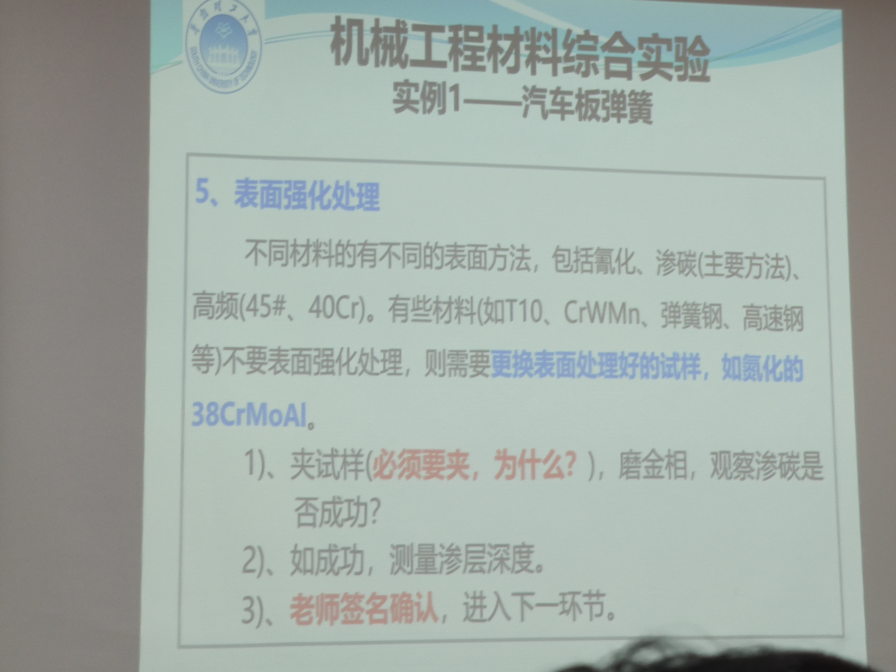

## PPT main

## [链接](https://ecourse.scut.edu.cn/web/gt/1/index.html?id=11038)

## 辉光效应

利用离子渗氮，无论是氧气还是氮气，其他一些气体，呈现紫色

## 20CrMnTi 金相图

炉子带电---戴上手套，关电
砂轮---不戴上手套

抛光----换纸，九十度，不能来回转圈

磨光----原本磨痕，看不见，只能看见当前的划痕

180-垂直磨-直到只有当前磨痕-180用力磨
不要倒角，一定要一个面
重复到1500
（由粗到细）
抛光
逆时针-右手边圆心15-20公分
挤抛光膏-抹平
转起来，倒水
抛到镜面
清洗

腐蚀
先加硝酸-用酒精清洗
镜面变亚灰
高碳-微黑

吹干-75度-快

洛氏
坑直径
（硬，快
顺3圈-红点%竖直方向10
归零是c
推140
20-70符合范围
读外圈

21  HRC

21  HRC

布
（硬软，慢
维

手靠近，感知温度是否是高温
手背微微靠一下
夹稳
断电
放入靠后
关门
通电
定时

正火-砖上-空冷-硬度，细化组织硬度，切削硬度
防氧化-

淬火-5-7圈，基本没声音
记得先关电
油-20
深入其中

表面处理
集肤效应-表面温度高-一定要快
用一个废块-垫

脱碳需要磨光

正火-看金相-深谈

慢冷
淬火-低温回火-看金相

50煤油30-强盛

不锈钢-深氮-轰击
不能打砂轮-1mm
写在侧面-补肾氮

530-
200-300Pa
0.2L/min

