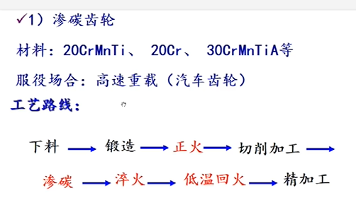
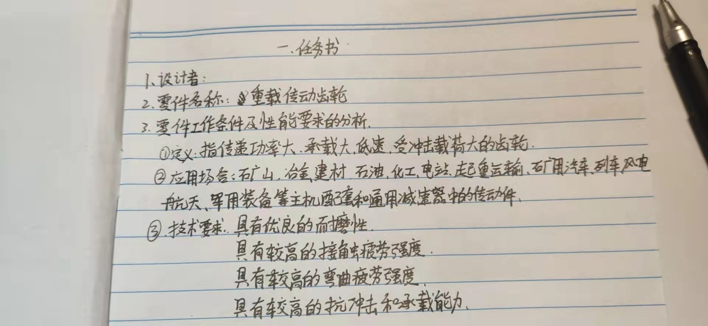
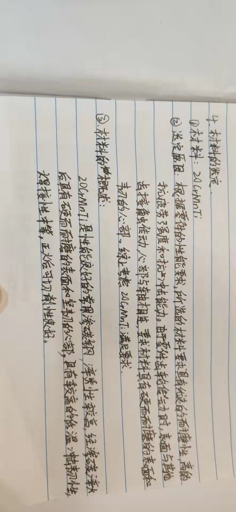
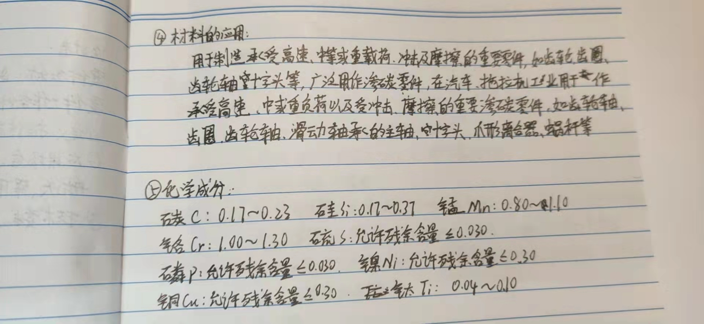
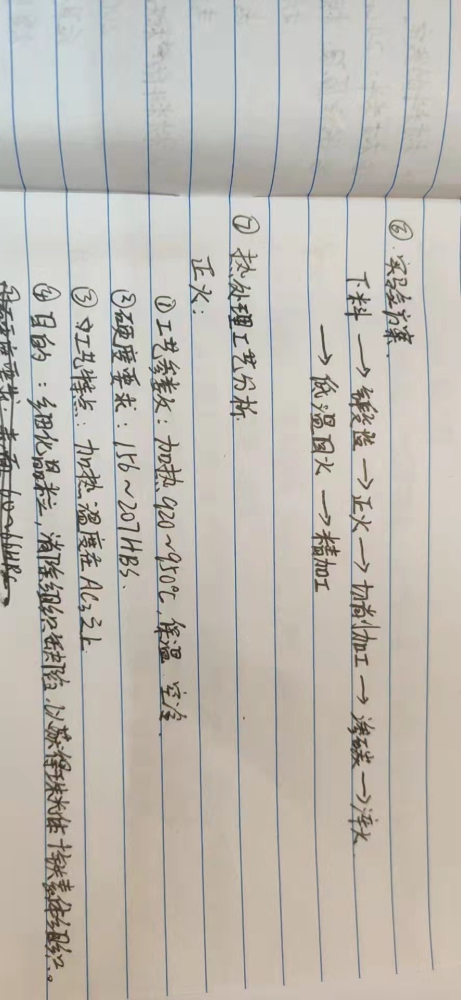
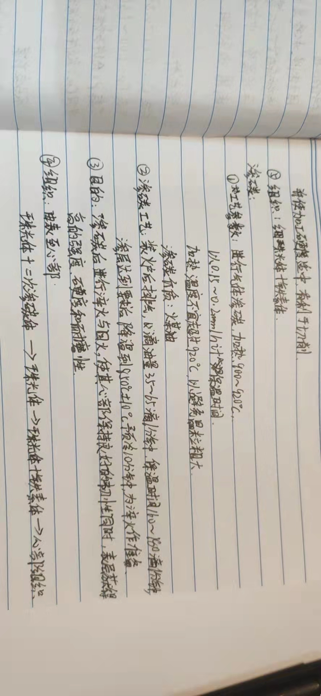
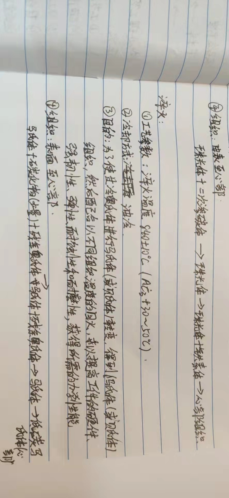
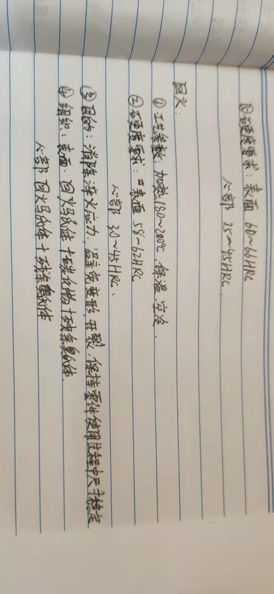

重载齿轮是指传递功率大 承载大 低速 受冲击载荷大的齿轮,技术要求其具有优良的耐磨性能 较高的接触疲劳强度和弯曲疲劳强度等,同时具有较高的抗冲击和承载能力,所以需要对其进行强化热处理,以提高综合力学性能及使用寿命 重载齿轮常用的强化热处理工艺有渗碳淬火 渗氮以及感应淬火等 本文综述了重载齿轮上述3种热处理技术的应用情况及进展,并提出重载齿轮真空低压渗碳的应用前景 
重载齿轮主要指为矿山 冶金 建材 石油 化工 电站 起重运输 矿用汽车 列车 风电 航天 军用装备等主机配套和通用减速器中的传动件,其应用范围广,遍及国民经济多个部门 重载齿轮的主要特点是传递功率大 摩擦力大 速度低 冲击力大,工作条件恶劣,安全性要求高 使用时要求具有优良的耐磨性能,较高的接触疲劳强度和弯曲疲劳强度,同时具有较高的抗冲击和抗过载能力

20CrMnTi 是性能良好的常用渗碳钢，淬透性较高，经渗碳淬火后具有硬而耐
磨的表面与坚韧的心部，具有较高的低温冲击韧性，焊接性中等，正火后可切削
性良好。其力学性能见表 3.1 所示。用于制造截面<30mm 的承受高速、中等或重载荷、冲击及摩擦的重要零件，如齿轮、齿圈、齿轮轴十字头等，广泛用作渗碳
零件，在汽车、拖拉机工业用于截面在 30mm 以下，承受高速、中或重负荷以及
受冲击、摩擦的重要渗碳零件，如齿轮轴、齿圈、齿轮轴、滑动轴承的主轴、十
字头、爪形离合器、蜗杆等。

[material](heat.pdf)

[material](https://wenku.baidu.com/view/c60be57c376baf1ffd4fad0e.html)

