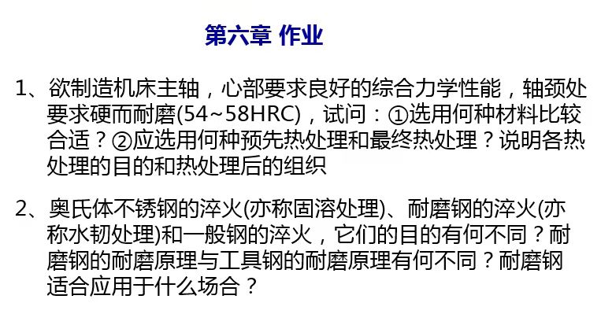

## question

✅

：奥氏体不锈钢的淬火、耐磨钢的淬火和一般钢的淬火，它们的目的有何不同?耐磨钢的耐磨原理与工具钢的耐磨原理有何不同?耐磨钢适合应用于什么场合?

：奥氏体不锈钢淬火(亦称固溶处理)的目的是为了获得单一、成分均匀的奥氏体组织，以获得良好的耐蚀性。耐磨钢淬火(亦称水韧处理)的目的是为了获得单一的奥氏体，塑、韧性好，同时使钢在特殊条件下表现出良好的耐磨性。一般钢的淬火目的是为了获得马氏体，使钢具有高的硬度、强度和耐磨性。 耐磨钢的耐磨原理是单一奥氏体组织在受到强大的冲击、压力时，表面层产生强烈的加工硬化，并诱发马氏体相变，使硬度和耐磨性显著增加，而心部仍保持原来的高韧性状态。工具钢一般是高碳钢，通过淬火获得高硬度的马氏体或者马氏体和部分粒状碳化物，使钢具有高的耐磨性。耐磨钢用于制作承受强烈冲击、巨大压力下工作的构件，例如挖掘机铲斗、车辆履带等。

✅本次查询到8条结果

：欲制造机床主轴，心部要求良好的综合力学性能，轴颈处要求硬而耐磨(54～58HRC)。试问： ①选用何种材料比较合适? ②应选择何种预先热处理及最终热处理?说明各种热处理的目的和热处理后的组织。

：(1)思路 机床主轴是机床的重要零件，而且心部要求良好的综合力学性能，因此应选用淬透性较好的中碳合金钢。中碳钢要具备良好的综合力学性能，应具有回火索氏体组织，所以最终需进行调质处理。轴颈处要求硬而耐磨，可在轴颈处进行表面淬火。中碳合金钢经表面淬火后，硬度可以达到要求。 预先热处理的选用从两个方面考虑：一是消除前一道工序锻造的组织缺陷，二是为后续的切削加工做准备。 (2)解答 选用调质钢40Cr。预先热处理选用退火，退火不仅可以消除锻造的组织缺陷，而且可以降低硬度，改善切削加工性能。退火后的组织为铁素体+珠光体。 最终热处理：整体采用调质处理后，轴颈处再进行表面淬火
    
因公众号限制，若无法使用，请< a href=" ">点击这里下载学小易APP</ a>，有疑问联系客服QQ 3007709237

